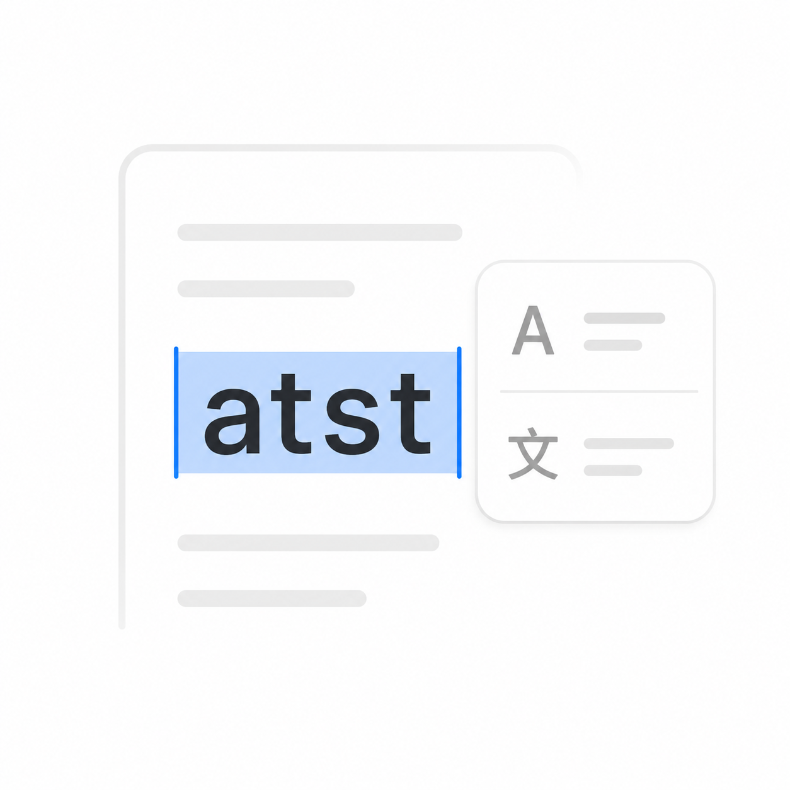
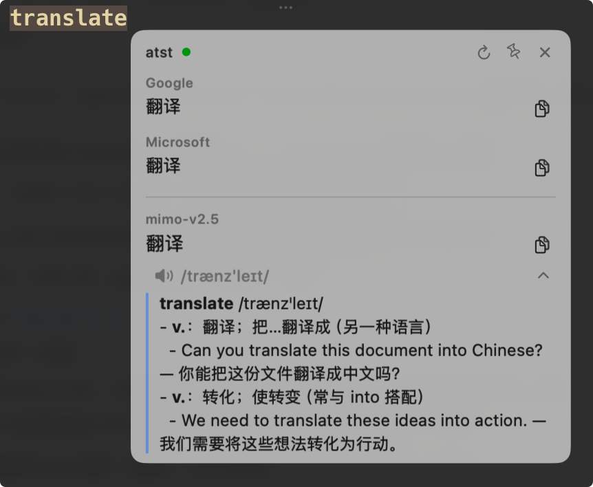
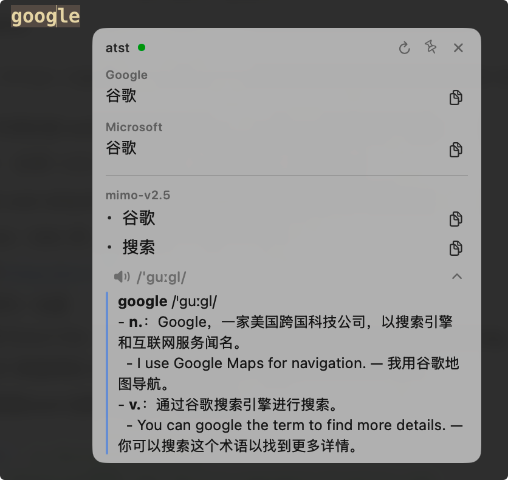
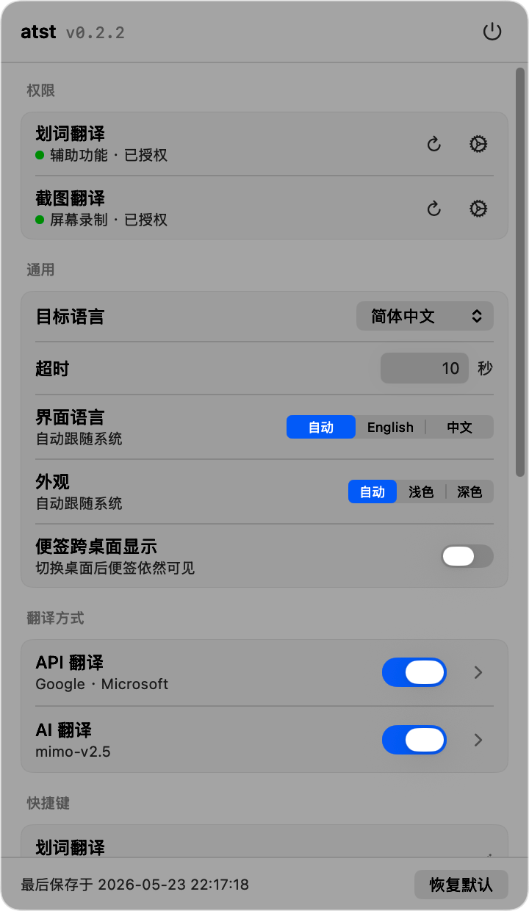

<div align="center">



# atst

**a(i)-text-select-translate** — a tiny menu-bar translator for macOS

`a`(i) · `t`ext · `s`elect · `t`ranslate

[](#requirements)
[](https://github.com/itaober/atst/releases/latest)
[](./LICENSE)

Hit a hotkey, get a translation. Works **out of the box** with built-in Google + Microsoft adapters, and unlocks AI-grade dictionary / explanation when you bring your own model.

[简体中文](./README.zh-CN.md) · [Install](#install) · [Usage](#usage) · [Features](#features)

</div>

---

## Highlights

- ⚡ **One-hotkey translation** — press `⌥D` on any selected text, anywhere in macOS, and a tooltip appears in ~200ms. `Esc` dismisses it
- 🔁 **Reverse translation** — text that's already in your target language is translated into your secondary language instead (Chinese ⇄ English out of the box)
- ⌨️ **Type to translate** — press `⌥D` with nothing selected, or hit the keyboard icon in settings, and type or paste
- 🖼️ **Screenshot translation** — press `⌥S`, drag a region, get the translation. On-device Vision OCR by default (fast + private + free); falls back to AI vision if you've configured one
- 🔀 **Multi-source side-by-side** — Google and Microsoft results stack above your AI result; identical results merge into one row
- 🧠 **AI dictionary mode** — for single words, AI providers can return multiple meanings, IPA phonetics, and a short usage explanation
- 📌 **Pin as note** — freeze a translation into a floating sticky note for later reference
- 💾 **Local cache** — repeat lookups hit a JSON cache, scoped per provider; configurable TTL and size cap
- 🫧 **Native Liquid Glass** — translation tooltips and pinned notes use Liquid Glass on macOS 26+ when available, with an automatic fallback on older systems
- 🪶 **Tiny footprint** — ~2 MB DMG, ~4 MB installed. Pure Swift/AppKit, no Electron, no Web view
- 🌐 **Bilingual UI** — auto English / Chinese based on system language, with a manual override
- 🆓 **Zero-config friendly** — works on a fresh install with no API keys (Google + Microsoft adapters); add an OpenAI-compatible endpoint when you want richer output

---

## Screenshots

<details>
<summary>Click to expand</summary>

<br />







</details>

---

## Install

### Download the latest release

1. Grab the latest `atst.dmg` from the [Releases page](https://github.com/itaober/atst/releases)
2. Open the DMG and drag **atst** into your `Applications` folder
3. Launch atst — a translate icon appears in your menu bar (top-right of the screen)
4. On first launch atst asks for **Accessibility** permission. The global hotkeys can't work without it, so click **Open System Settings** and switch atst on under Privacy & Security → Accessibility. Skipped the dialog? Click the menu bar icon and use the gear next to the permission row
5. Optional: turn on **Launch at login** in the General settings

> **Heads up**: because atst is a self-signed app (no Apple Developer ID yet), the first launch may show "atst can't be opened because it is from an unidentified developer". Right-click the app → **Open** → **Open anyway**, or run `xattr -d com.apple.quarantine /Applications/atst.app` once. Every release is re-signed, so macOS may ask for Accessibility again after an upgrade.

### Build from source

Requires **macOS 14+** and **Swift 5.9+** (Xcode 15 / Command Line Tools).

```bash
git clone https://github.com/itaober/atst.git
cd atst

# Quick dev build
swift run atst

# Build a packaged .app bundle (with icon + Info.plist + codesign)
bash Scripts/build-app.sh
open .build/atst.app

# Build a DMG installer
bash Scripts/build-dmg.sh
open .build/atst.dmg
```

---

## Usage

### Hotkeys

| Hotkey | Action |
|---|---|
| `⌥D` | Translate the currently selected text — or open a text box when nothing is selected |
| `⌥S` | Screenshot a region and translate the text it contains |
| `Esc` | Dismiss the tooltip |

Both translation hotkeys are reconfigurable in **Settings → Hotkeys**.

### The translation tooltip

The header shows the detected source language and the target (e.g. `English → 简体中文`). Below it you'll see one or two sections:

- **Top — API results** (Google, Microsoft): fast and free, no API key required. When both return the same text they share one row
- **Bottom — AI result** (if enabled): richer output with multiple meanings, IPA phonetics, and explanations for technical terms

Each row has its own copy button. The whole tooltip is **draggable from its header** if you want to move it out of the way; `Esc` or a click outside dismisses it. Click the pin (📌) in the header to freeze it into a sticky note.

If a provider fails three times in a row (blocked network, dead endpoint) its row collapses to a single line with a **Disable** button, so it stops shouting on every translation.

### Reverse translation

If the text you select is already in your target language, atst translates it into your **secondary language** instead — so a Chinese target still gives you English for Chinese selections. Both languages are set in General settings.

### Translator settings

Click the **`atst`** label in your menu bar to open the settings panel.

The General page holds the target and secondary languages, launch-at-login, hotkeys, screenshot OCR and cache options, plus two translator toggles:

- ☑️ **API Translation** (on by default) — Google + Microsoft. Zero config.
- ☐ **AI Translation** (off by default) — OpenAI-compatible endpoint. Configure base URL + key + model in the AI subpage.

#### AI configuration (optional)

Inside **AI Translation** subpage:

- **Base URL** — any OpenAI-compatible endpoint, e.g. `https://api.openai.com/v1`, `http://localhost:11434/v1` (Ollama), `https://generativelanguage.googleapis.com/v1beta/openai/` (Gemini OpenAI-compat)
- **API Key** — kept locally in `~/Library/Preferences/dev.local.atst.plist`
- **Translation Model** — model name to use for selection translation (e.g. `gpt-4o-mini`, `qwen2.5:7b`)
- **Screenshot Model** — vision-capable model used when **Vision OCR** is OFF (e.g. `gpt-4o`, `claude-3.5-sonnet`)
- **Timeout** — idle limit per AI request (Google / Microsoft use a fixed 15 s)
- **Phonetic** — append IPA to single-word lookups
- **Smart Explanation** — add a dictionary-style explanation block (idioms, proper-noun definitions, etc.)
- **Translation Prompts** — fully editable system + smart-explanation prompts

#### Screenshot OCR settings

The **Screenshot** section in the General page controls how `⌥S` works:

- ☑️ **Use Vision OCR** (on by default) — recognise text on-device with macOS Vision (no AI needed!), then translate via the selected providers
- ☐ **Use Vision OCR** OFF — send the screenshot directly to your AI vision model

Add or remove recognition languages from the chip row below. Default: Simplified Chinese + English + Japanese.

---

## Features

### Translation providers

| Provider | Key required | Free | Streaming | Multi-meaning | Phonetic | Explanation |
|---|---|---|---|---|---|---|
| Google (built-in) | ❌ | ✅ | — | ❌ | ❌ | ❌ |
| Microsoft (built-in) | ❌ | ✅ | — | ❌ | ❌ | ❌ |
| OpenAI-compatible | ✅ | depends | ✅ | ✅ | ✅ | ✅ |

### Other goodies

- **Smart tooltip placement** — Web-style flip algorithm; tooltip never gets pushed off-screen or covers your selection
- **Adaptive glass surface** — native Liquid Glass on macOS 26+ with Swift 6.2+ builds; older macOS versions keep the AppKit `NSVisualEffectView` tooltip material
- **Cache stats** — see how many entries are cached and how much disk they're using, with a one-click clear button
- **Untranslatable detection** — proper nouns / brands / misspellings get a 🔘 marker and skip the cache
- **Theme** — Auto / Light / Dark, applied app-wide

---

## Requirements

- macOS **14.0** (Sonoma) or later
- **Apple Silicon** — the release DMG is built for arm64 only. Intel Macs: build from source (see above)
- A handful of MB of disk for the local cache
- For AI features: any OpenAI-compatible endpoint (paid or local-LLM)

---

## Privacy

- atst is a **local app**. No telemetry, no analytics, no crash reporters.
- Translation providers (Google, Microsoft, your AI endpoint) receive only the text you trigger a translation for. Language detection for the tooltip header and reverse translation runs on-device.
- Network activity beyond translations: one request to `api.github.com` per launch (at most every 4 h) to check for a newer release, and a small connection-warming request to each enabled provider when you press a hotkey's modifier key.
- Cache lives at `~/Library/Caches/dev.local.atst/translations.json`. Settings live at `~/Library/Preferences/dev.local.atst.plist`. Delete either at any time.
- A diagnostic log is written to `/tmp/atst.log`; it includes the first characters of translated text. Delete it whenever you like.

---

## Troubleshooting

- **Hotkeys do nothing** — Accessibility isn't granted (menu bar icon → Permissions shows an orange dot), or another app has turned on macOS Secure Keyboard Entry (1Password autofill, Terminal with that option on, a focused password field); settings shows a warning while that's the case.
- **Screenshot translation produces nothing** — check Screen Recording permission, then open `/tmp/atst-last-screenshot.png` to see what was captured.
- **Reporting a bug** — attach `/tmp/atst.log` (rotates at ~1 MB to `/tmp/atst.old.log`).
- **Scripting the AI config** — these environment variables override the saved settings for one run: `ATST_AI_BASE_URL`, `ATST_API_KEY`, `ATST_TEXT_MODEL`, `ATST_SCREENSHOT_MODEL`, `ATST_TARGET_LANGUAGE`.

---

## Roadmap

Things on the radar (open an issue if you'd like to vote one up):

- [ ] Custom HTTP translation providers (template-driven; bring your own DeepL / Lingva / Libretranslate)
- [ ] Translation history with full-text search
- [ ] Universal (Intel + Apple Silicon) release binary
- [ ] Apple Notarization + proper code signing (no more right-click → Open)

---

## License

Apache 2.0 — see [LICENSE](./LICENSE) for details.

## Acknowledgments

- macOS [Vision framework](https://developer.apple.com/documentation/vision) for the OCR engine
- The OpenAI Chat Completions protocol — adopted by virtually every modern LLM endpoint
- Built with [Claude Code](https://claude.com/claude-code) in collaboration with the author
